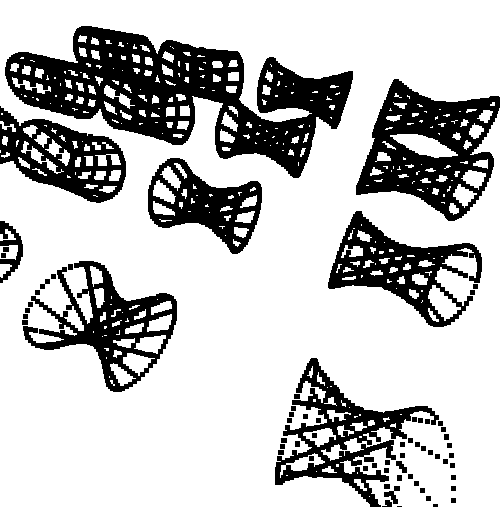

# higher_order_point
An experimental higher order data structure for 3D points

Builds on the abstraction defined in [higher_order_core](https://github.com/advancedresearch/higher_order_core).

*Notice! This abstraction is still very early in development.*

[hyperbola example](./examples/hyperbola.rs)

This example shows how to generate a hyperbolic shape
by twisting circles connected by lines.
